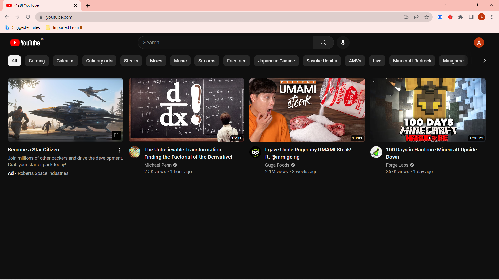
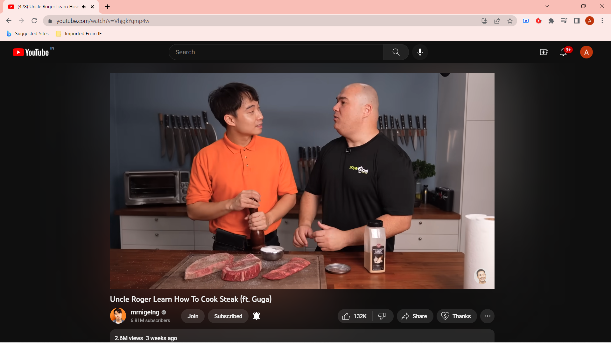

> [!Note]
> I have lost interest in this extension, simply because, I have stopped using YouTube to consume video content. And, there are some good extensions out there with many features and are being actively developed. 
> If someone wish to continue the very extension they can fork this repository and maintain their own version.

<!-- PROJECT SHIELDS -->
<!-- https://www.markdownguide.org/basic-syntax/#reference-style-links-->
[![Contributors][contributors-shield]][contributors-url]
[![Forks][forks-shield]][forks-url]
[![Stargazers][stars-shield]][stars-url]
[![Issues][issues-shield]][issues-url]
[![MIT License][license-shield]][license-url]
[![LinkedIn][linkedin-shield]][linkedin-url]

<!-- PROJECT LOGO -->
 

  
  
  <h3 align="center">own-youtube</h3>

  

    <i>Modify YouTube's layout in real-time and make it distraction free, like you own it!</i>
     
    <a href="https://github.com/proffapt/own-youtube"><strong>Explore the docs »</strong></a>
     
     
    <a href="https://github.com/proffapt/own-youtube/issues">Report Bug</a>
    ·
    <a href="https://github.com/proffapt/own-youtube/issues">Request Feature</a>
  

<!-- TABLE OF CONTENTS -->

  
Table of Contents

  <ol>
    <li>
      <a href="#about-the-project">About The Project</a>
      <ul>
        <li><a href="#supports">Supports</a></li>
        <li><a href="#built-with">Built With</a></li>
      </ul>
    </li>
    <li>
      <a href="#getting-started">Getting Started</a>
      <ul>
        <li><a href="#installation">Installation</a></li>
			<ul>
				<li><a href="#chrome">Chrome</a></li>
				<li><a href="#firefox">Firefox</a></li>
			</ul>
      </ul>
    </li>
    <li><a href="#features">Features</a>
      <ul>
        <li><a href="#basic">Basic</a></li>
        <li><a href="#topbar">Top Bar Elements</a></li>
        <li><a href="#homepage">Homepage</a></li>
        <li><a href="#leftbar">Left Navigation Bar</a></li>
        <li><a href="#moreyt">More from Youtube</a></li>
        <li><a href="#videoply">Video Player</a></li>
        <li><a href="#remelem">Remove Element Options</a></li>
        <li><a href="#searchres">Search Results</a></li>
      </ul>
    </li>
    <li><a href="#screenshots">Extension in Action</a></li>
    <li><a href="#contact">Contact</a></li>
    <li><a href="#acknowledgments">Acknowledgments</a></li>
    <li><a href="#miscellaneous">Miscellaneous</a></li>    
  </ol>

<!-- ABOUT THE PROJECT -->
## About The Project

Have you ever sat down to watch that one important video on Youtube, and got up 3 hours later with no memory what you opened Youtube for? Well, experience that no more with this browser extension, that lets you remove any and all sources of distractions on the website.

(<a href="#top">back to top</a>)

### Supports:

* [Chrome](https://www.google.com/chrome/index.html) and other [Chromium](https://www.chromium.org/getting-involved/download-chromium/) based browsers
* [Firefox](https://www.mozilla.org/en-US/firefox/new/) and its derivatives

(<a href="#top">back to top</a>)

### Built With

This project is made with following langs/frameworks.
* [HTML](https://en.wikipedia.org/wiki/HTML)
* [CSS](https://www.w3.org/Style/CSS/Overview.en.html)
* [JavaScript](https://www.javascript.com/)

(<a href="#top">back to top</a>)

<!-- GETTING STARTED -->
## Getting Started

### Installation

_To get a local copy up and running follow these simple steps._

1. Clone the repository with `git clone https://github.com/proffapt/own-youtube`.
2. Now depending upon your browser of choice, follow the steps in respective sections:

	- [Chrome](#chrome)
	- [Firefox](#firefox)

	#### Chrome

	1. Type `chrome://extensions` on search bar
	2. Toggle the **DEVELOPER MODE** on top right corner
	3. Click **LOAD UNPACKED** option and select the `src/chrome` folder from the cloned repository.

	#### Firefox
	
	1. Type `about:debugging#/runtime/this-firefox` on search bar
	2. Click on the `Load Temporary Add-on...` button under **Load Temporary Extensions** Section
	3. Navigate to `src/firefox` folder in your opened file navigator
	4. Select the `manifest.json` file inside it and press **open**

(<a href="#top">back to top</a>)

## Features

Basic

- **Home Page** : Hide the entire Home Page
- **Side Bar** : Hide the Side Bar (when watching a video)
- **End of Video** : Hide the video reccomendations that appear at the end of a video

(<a href="#Features">back to Features</a>)

 Top Bar Elements

- **Youtube Apps and Create**
- **Notifications**
- **Avatar** : Hide your user profile logo (links to settings)

(<a href="#Features">back to Features</a>)

 Homepage

- **All but First row** : Hides all the video thumbnaikls except the Featuresmost row
- **Infinite Scroll** : Limits your number of video reccomendations on the Home Page
- **Extra Rows** : Hides extras like shorts, trending, etc.

(<a href="#Features">back to Features</a>)

 Left Navigation Bar

- **Complete Bar** : Completely removes the left navigation bar
- **Logo link** : Makes the logo not clickable (to link to the homepage)
- **Home**
- **Explore**
- **Shorts**
- **Subscriptions**
- **Library**
- **History**
- **Your Videos**
- **Watch Later**
- **Liked Videos**
- **Subscriptions Pane** : The actual list of subscribed channels

(<a href="#Features">back to Features</a>)

 More from Youtube

- **Premium**
- **Films**
- **Trending**
- **Gaming**
- **Live**
- **Fashion**
- **Learning**
- **Sports**
- **Creator Studio**
- **YouTube Music**
- **YouTube Kids**
- **Footer Pane**

(<a href="#Features">back to Features</a>)

 Video Player

- **Remove Ads** : Play Ads at 5x and auto-skip
- **Auto continue** : Remove the popup appearing after a while when listening without interacting with the site
- **Center Content** : Remove the left and right panes, and center the video player
- **Disable AuFeatureslay**
- **Redirect Shorts** : Play shorts in the normal video player

(<a href="#Features">back to Features</a>)

 Remove Element Options

- **In-video info cards**
- **Play-next button**
- **Menu buttons** : Remove the Like, Dislike, Share, etc
- **Comments**
- **ChatLive-Streaming** : Remove the Live Stream chat
- **More videos (embedded player)** : Remove the video reccommendations that appear when paused

(<a href="#Features">back to Features</a>)

 Search Results page

- **Extra results** : Remove extra 'For You' 'Also Watch' results
- **Shorts results**
- **Thumbnail slideshow** : Don't play the preview of video upon hovering on thumbnail

(<a href="#Features">back to Features</a>)

 Redirect the HomePage

&nbsp;&nbsp;&nbsp;&nbsp;&nbsp;&nbsp;Redirect where clicking the Youtube Logo takes you

(<a href="#Features">back to Features</a>)

 

(<a href="#top">back to top</a>)

## The extension in action
 

</img>

 

</img>

(<a href="#top">back to top</a>)

<!-- CONTACT -->
## Contact

📫 Arpit Bhardwaj ( aka proffapt ) -   

 
 
 

(<a href="#top">back to top</a>)

<!-- ACKNOWLEDGMENTS -->
## Acknowledgments

* [Choose an Open Source License](https://choosealicense.com)
* [Img Shields](https://shields.io)
<!-- UPDATE -->

(<a href="#top">back to top</a>)

## Miscellaneous

Do consider looking at other paradigms of this documentation
  - [Change-logs](/.github/CHANGELOG.md)
  - [License used](/LICENSE.txt)
  - [Code Of Conduct](/.github/CODE_OF_CONDUCT.md)
  - [How to contribute?](/.github/CONTRIBUTING.md)

(<a href="#top">back to top</a>)

<!-- MARKDOWN LINKS & IMAGES -->

[contributors-shield]: https://img.shields.io/github/contributors/proffapt/own-youtube.svg?style=for-the-badge
[contributors-url]: https://github.com/proffapt/own-youtube/graphs/contributors
[forks-shield]: https://img.shields.io/github/forks/proffapt/own-youtube.svg?style=for-the-badge
[forks-url]: https://github.com/proffapt/own-youtube/network/members
[stars-shield]: https://img.shields.io/github/stars/proffapt/own-youtube.svg?style=for-the-badge
[stars-url]: https://github.com/proffapt/own-youtube/stargazers
[issues-shield]: https://img.shields.io/github/issues/proffapt/own-youtube.svg?style=for-the-badge
[issues-url]: https://github.com/proffapt/own-youtube/issues
[license-shield]: https://img.shields.io/github/license/proffapt/own-youtube.svg?style=for-the-badge
[license-url]: https://github.com/proffapt/own-youtube/blob/master/LICENSE.txt
[linkedin-shield]: https://img.shields.io/badge/-LinkedIn-black.svg?style=for-the-badge&logo=linkedin&colorB=555
[linkedin-url]: https://linkedin.com/in/proffapt
[product-screenshot]: images/screenshot.png
