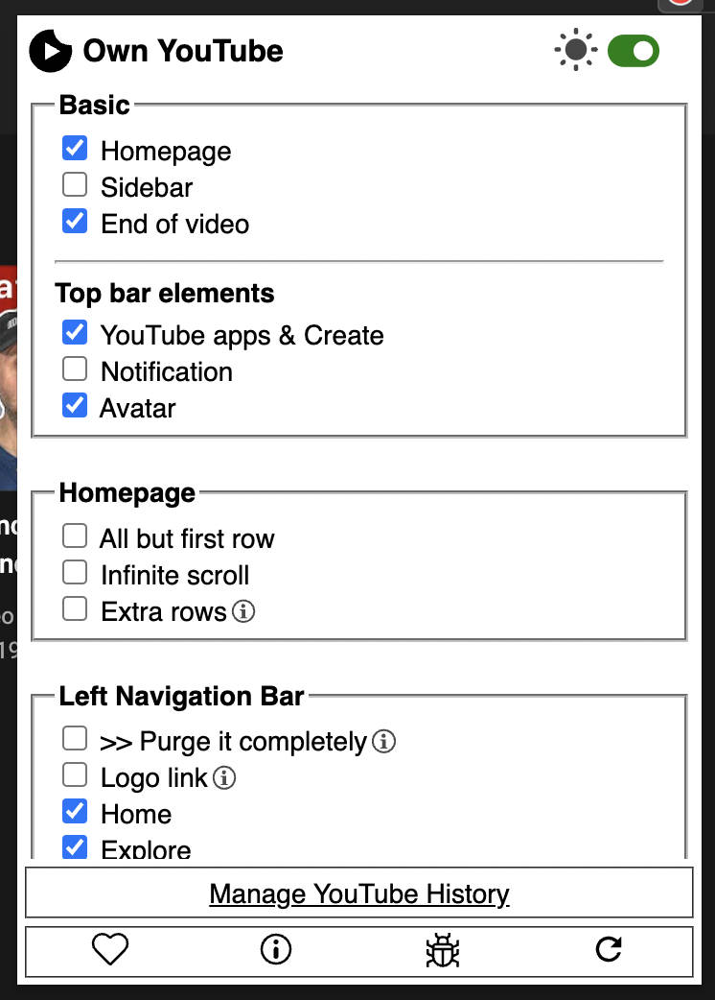

<div id="top"></div>

## MUST UPDATE THE FOLLOWING FILES :  `images`, `CHANGELOG.md`, `README.md`
## DEPENDS ON SPECIAL CASES : `.gitignore`, `LICENSE.txt`

<!-- PROJECT SHIELDS -->
<!-- https://www.markdownguide.org/basic-syntax/#reference-style-links-->
[![Contributors][contributors-shield]][contributors-url]
[![Forks][forks-shield]][forks-url]
[![Stargazers][stars-shield]][stars-url]
[![Issues][issues-shield]][issues-url]
[![MIT License][license-shield]][license-url]
[![LinkedIn][linkedin-shield]][linkedin-url]


<!-- PROJECT LOGO -->
<br />
<div align="center">
  <a href="https://github.com/proffapt/own-youtube">
    
  </a>
  
  <h3 align="center">own-youtube</h3>

  <p align="center">
  <!-- UPDATE -->
    <i>Project one liner slogan goes here</i>
    <br />
    <a href="https://github.com/proffapt/own-youtube"><strong>Explore the docs »</strong></a>
    <br />
    <br />
    <a href="https://github.com/proffapt/own-youtube/issues">Report Bug</a>
    ·
    <a href="https://github.com/proffapt/own-youtube/issues">Request Feature</a>
  </p>
</div>


<!-- TABLE OF CONTENTS -->
<details>
  <summary>Table of Contents</summary>
  <ol>
    <li>
      <a href="#about-the-project">About The Project</a>
      <ul>
        <li><a href="#supports">Supports</a></li>
        <li><a href="#built-with">Built With</a></li>
      </ul>
    </li>
    <li>
      <a href="#getting-started">Getting Started</a>
      <ul>
        <li><a href="#prerequisites">Prerequisites</a></li>
        <li><a href="#installation">Installation</a></li>
      </ul>
    </li>
    <li><a href="#usage">Usage</a></li>
    <li><a href="#roadmap">Roadmap</a></li>
    <li><a href="#contributing">Contributing</a></li>
    <li><a href="#changelog">Change.log</a></li>
    <li><a href="#license">License</a></li>
    <li><a href="#contact">Contact</a></li>
    <li><a href="#acknowledgments">Acknowledgments</a></li>
  </ol>
</details>


<!-- ABOUT THE PROJECT -->
## About The Project
<!-- UPDATE -->
<div align="center">
  <a href="https://github.com/proffapt/own-youtube">
    
  </a>
</div>

_Detailed explaination of the project goes here_

<p align="right">(<a href="#top">back to top</a>)</p>

<div id="supports"></div>

### Supports:
1. Shells
    * `bash`
    * `fish`
    * `zsh`
2. OS(s)
    * `MacOS`[`BSD` based]
    * any `*nix`[`GNU+Linux` and `Unix`]

<p align="right">(<a href="#top">back to top</a>)</p>

### Built With

This project is made with following langs/frameworks.
* [HTML](https://en.wikipedia.org/wiki/HTML)
* [CSS](https://www.w3.org/Style/CSS/Overview.en.html)
* [JavaScript](https://www.javascript.com/)

<p align="right">(<a href="#top">back to top</a>)</p>


<!-- GETTING STARTED -->
## Getting Started

To get a local copy up and running follow these simple steps.

### Prerequisites
<!-- UPDATE -->
You will need to install the following dependencies for the project to work.
* npm
  ```sh
  npm install npm@latest -g
  ```

<p align="right">(<a href="#top">back to top</a>)</p>

### Installation

_Now since we are done with the setting up of environment suitable for the project to compile/run, let's install and configure the project on your system locally now._
<!-- UPDATE -->
1. Clone the repo
   ```sh
   git clone https://github.com/proffapt/own-youtube.git
   ```
2. Make the script executable
   ```sh
   cd ./own-youtube
   chmod +x ./own-youtube
   ```
3. Execute the script
   ```sh
   ./own-youtube
   ```

<p align="right">(<a href="#top">back to top</a>)</p>


<!-- ROADMAP -->
## Roadmap
- [x] Take complete control of left navigation bar
- [x] Take complete control of top bar
- [ ] Align the content to centre when left navigation bar is purged completely

See the [open issues](https://github.com/proffapt/own-youtube/issues) for a full list of proposed features (and known issues).

<p align="right">(<a href="#top">back to top</a>)</p>


<!-- CONTRIBUTING -->
## Contributing

Contributions are what make the open source community such an amazing place to learn, inspire, and create. Any contributions you make are **greatly appreciated**.

If you have a suggestion that would make this better, please fork the repo and create a pull request. You can also simply open an issue with the tag "enhancement".
Don't forget to give the project a star! Thanks again!

1. Fork the Project
2. Create your Feature Branch (`git checkout -b feature/AmazingFeature`)
3. Commit your Changes (`git commit -m 'Add some AmazingFeature'`)
4. Push to the Branch (`git push origin feature/AmazingFeature`)
5. Open a Pull Request

<p align="right">(<a href="#top">back to top</a>)</p>


<!-- Changelog -->
# Changelog

## v1.0.0

### Added or Changed
- Added each and every element from sidebar
- Purge the side-bar completely!
- Toggle top bar buttons(including avatar, notifications etc.)
- Remove ads
- Redirect/disable youtube logo link
- every other thing you need to make it distraction free

<p align="right">(<a href="#top">back to top</a>)</p>

<!-- LICENSE -->
## License

Distributed under the BSD-2-Clause License. See `LICENSE.txt` for more information.

<p align="right">(<a href="#top">back to top</a>)</p>


<!-- CONTACT -->
## Contact

Arpit Bhardwaj - [Twitter](https://twitter.com/proffapt) - [Telegram](https://t.me/proffapt) - proffapt@protonmail.com

Company website: [Cybernity](https://cybernity.org) - [CybernityForum](https://cybernity.group)

Project Link: [https://github.com/proffapt/own-youtube](https://github.com/proffapt/own-youtube)

<p align="right">(<a href="#top">back to top</a>)</p>


<!-- ACKNOWLEDGMENTS -->
## Acknowledgments

* [Choose an Open Source License](https://choosealicense.com)
* [Img Shields](https://shields.io)
* [Remove Youtube Suggestions](https://github.com/lawrencehook/remove-youtube-suggestions)

<p align="right">(<a href="#top">back to top</a>)</p>


<!-- MARKDOWN LINKS & IMAGES -->

[contributors-shield]: https://img.shields.io/github/contributors/proffapt/own-youtube.svg?style=for-the-badge
[contributors-url]: https://github.com/proffapt/own-youtube/graphs/contributors
[forks-shield]: https://img.shields.io/github/forks/proffapt/own-youtube.svg?style=for-the-badge
[forks-url]: https://github.com/proffapt/own-youtube/network/members
[stars-shield]: https://img.shields.io/github/stars/proffapt/own-youtube.svg?style=for-the-badge
[stars-url]: https://github.com/proffapt/own-youtube/stargazers
[issues-shield]: https://img.shields.io/github/issues/proffapt/own-youtube.svg?style=for-the-badge
[issues-url]: https://github.com/proffapt/own-youtube/issues
[license-shield]: https://img.shields.io/github/license/proffapt/own-youtube.svg?style=for-the-badge
[license-url]: https://github.com/proffapt/own-youtube/blob/master/LICENSE.txt
[linkedin-shield]: https://img.shields.io/badge/-LinkedIn-black.svg?style=for-the-badge&logo=linkedin&colorB=555
[linkedin-url]: https://linkedin.com/in/proffapt
[product-screenshot]: images/screenshot.png
